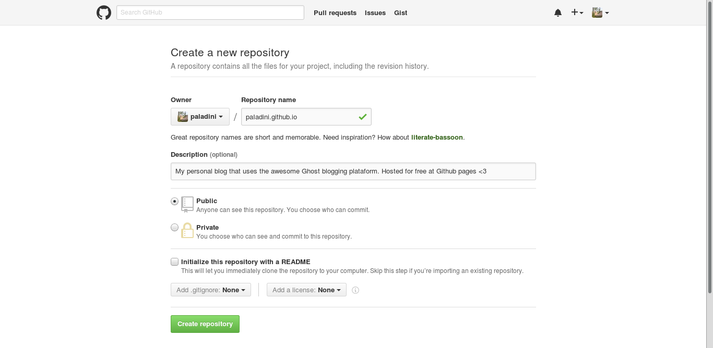
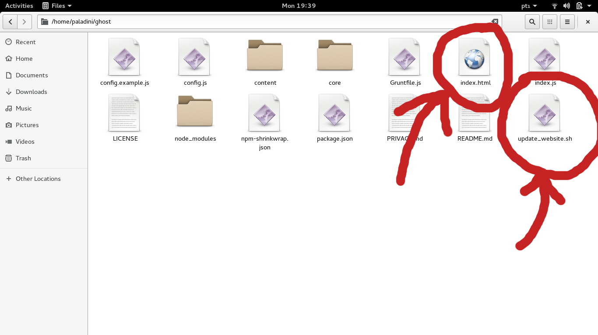

# Ghost on Github Pages


[Ghost](https://github.com/tryghost/Ghost) is a simple, powerful publishing platform that allows you to share your stories with the world. It usually needs a paid host, but there's some ways to host your Ghost installation at Github Pages, for free.

In order to create your own Ghost blog for free and host it at Github pages, check the following instructions. These instructions were tested within Linux, if you know how to make it work for Windows or Mac OS, please let me know and I'll add the instructions here. [**Check out the Live Demo**](https://github.com/paladini/paladini.github.io).

**Note:** that the first time installation take some time (about 10 minutes), but after that you just need to run `npm start` to use Ghost at your computer (creating posts, modifying the website, etc.) and `./update_website.sh` to send the changes to your website. Simple as that.

## Requirements

### Major dependencies
All packages listed below as `Major dependencies` should be installed in your computer by our own. Note that many of these dependencies are bundled with modern operating systems - if you're a lucky person, maybe you don't need to install any of the requirements bellow.

- Python 2: some Python 2.X is required because `buster` package doesn't support Python 3.
- [NodeJS](https://nodejs.org/en/): you should install a [NodeJS version that is officially supported by Ghost](http://support.ghost.org/supported-node-versions/). Node Version Manager (nvm) is recommended for many NodeJS versions on the same machine.
- [npm](https://nodejs.org/en/): NodeJS package manager.


### Minor dependencies

There's some other dependencies that should be installed in order to this script work fine, but I've made my best to automagically install these minor dependencies for you. This automated dependency installation has been tested on MacOS High Sierra and Ubuntu 16.04 and I hope that it work for you too.

**The minor dependencies are:**

- pip, the official Python package manager.
- buster, a Python package responsible for generating the static content from the Ghost server.
- knex-migrator, a Node package that serves as a database migration tool.

## Installing for the first time
#### 1) Download the latest version of Ghost at [Ghost download page](https://ghost.org/developers/).


#### 2) Extract it somewhere you'll remember. In my example, at `/home/paladini/ghost`.


#### 3) Open the Terminal and navigate to the extracted folder. Run `npm install`.


#### 4) Now we've Ghost installed. Let's start it's localhost server running `npm start`:


#### 5) Ghost now will be live at [http://localhost:2368](http://localhost:2368). Let's create your user and configure Ghost for the first time: go to [http://localhost:2368/ghost](http://localhost:2368/ghost) and follow the instructions.


#### 6) Now you are at the Ghost Administrative Panel, personalize your page and create the desired content.


#### 7) Go to [Github.com](http://www.github.com) and create a repository called `YOUR_USERNAME.github.io` (in my case it was [paladini.github.io](http://paladini.github.io)).


#### 8) Download [this script](https://github.com/paladini/ghost-for-github-pages/blob/master/update_website.sh) and [this HTML page](https://raw.githubusercontent.com/paladini/ghost-on-github-pages/master/index.html) and put it inside Ghost folder. Open a terminal window, go the Ghost folder and run `chmod +x update_website.sh`.


#### 9) Open another Terminal window and go to Ghost folder (in my case: `/home/paladini/ghost`). Run the following commands:

```sh
buster setup
buster generate
git init
git remote add origin git@github.com:YOUR_USERNAME/YOUR_USERNAME.github.io.git
git add -A
git commit -m "First commit"
git push origin master -f
```

#### 10) After about 10 minutes (according to Github Pages), your website will be live at [http://YOUR_USERNAME.github.io](http://YOUR_USERNAME.github.io). In my case, this is my page:


## Updating the website [creating new posts, changing theme, etc.]
Whenever you want to create a new post, change the theme of the site (etc.), you should run `npm start` inside the Ghost folder to start the server at the localhost. Then you can go to [http://localhost:2368/ghost/](http://localhost:2368/ghost/) and do whatever you want to.

To send the changes to your page, just run `./update_website.sh` from the Terminal. Remember that Github takes about 10 minutes to update the website.

## About
This readme was created in less than one hour, so if it have any problems or you has some question in some topic, please contact me at fernandopalad at gmail dot com. Feel free to improve it or make any critics.

**References:**
- http://ledtechnica.com/free-ghost-hosting-on-github-pages/